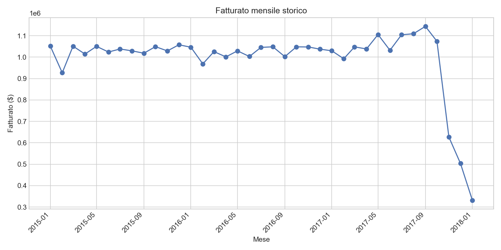
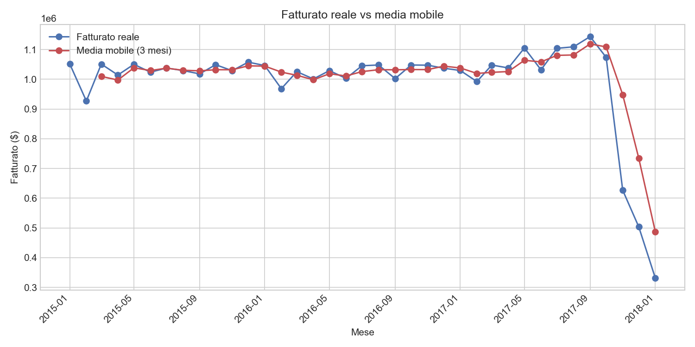
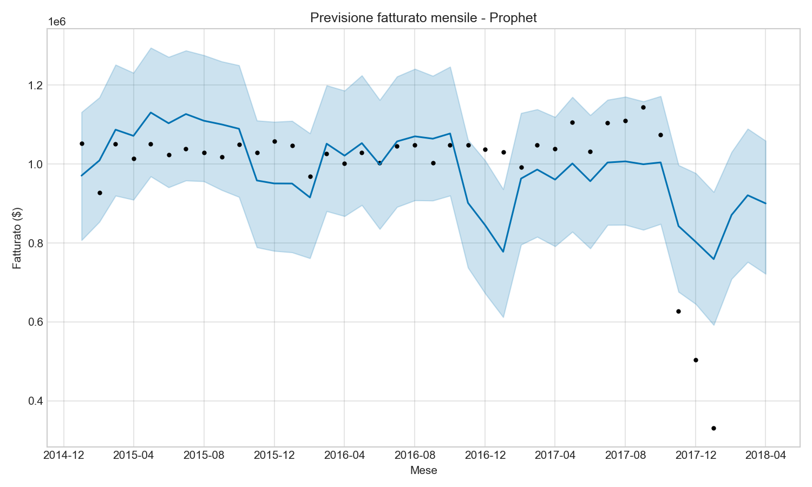
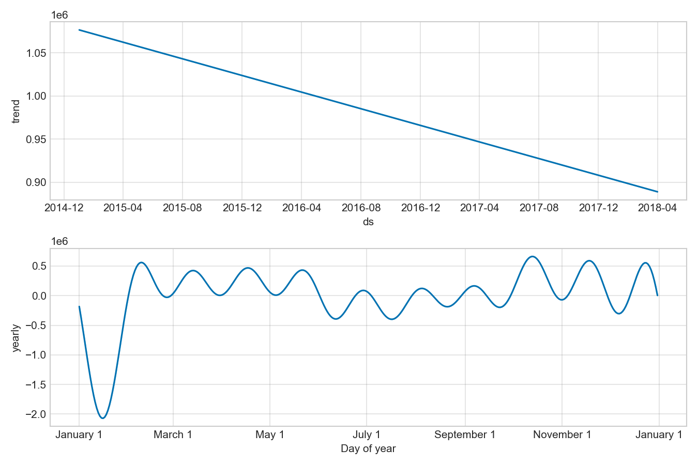

# DataCo supply chain analytics

SQL analysis on a global supply chain dataset (18,000+ orders, 50+ variables), aimed at identifying patterns in delivery times, delays, and performance by product category and region.

## Dataset

[DataCo Smart Supply Chain for Big Data Analysis](https://www.kaggle.com/datasets/shashwatwork/dataco-smart-supply-chain-for-big-data-analysis) — simulated data on orders, shipments, customers, and products for a global distribution company.

## Objective

Answering operational questions typical of a supply chain / ops role:
- Which regions have the highest delivery delays?
- Which shipping modes are the most reliable?
- Which product categories generate the most revenue?
- How does revenue vary over time?

## Structure

- `dataco_starter.py` — loads the CSV into MySQL and runs sample KPI queries
- `queries/kpi_queries.sql` — all SQL queries written for the analysis

## Key results

- The region with the highest average delivery delay is Central Asia, with a 0.65-day average delay
- The most reliable shipping mode is Standard Class, with only 39% of orders at risk of delay
- The Fishing category alone generates about $7 million in revenue, nearly double the second category (Cleats)

## Visualizations

---

# Demand forecasting

Monthly revenue forecasting based on historical data, comparing a simple approach (moving average) with a more advanced model (Prophet).

## Objective

Answering questions useful for operational planning:
- Is revenue trending up or down over time?
- Are there recurring seasonal patterns?
- What revenue should be expected in the coming months?

## Setup

1. Make sure the MySQL `supply_chain` database is already populated (see project 1)
2. Install the additional dependencies: `pip install jupyterlab prophet`
3. Launch Jupyter Lab: `jupyter lab`
4. Open `demand_forecasting.ipynb`, update the MySQL credentials, run the cells in order

## Structure

- `demand_forecasting.ipynb` - notebook with the full analysis: data loading, moving average, Prophet model, results verification

## Key results

- Revenue shows a **steady downward trend** over the observed period, going from about $1.08 million (end of 2014) to about $0.89 million (early 2018)
- Yearly seasonality shows a marked dip in early January and recurring peaks between late October and early November. Checking the number of orders per month, January does not show a lower order volume than other months - so the dip appears to be a genuine seasonal pattern (e.g. a post-holiday slowdown), not an artifact of incomplete data
- The forecast for the next 3 months indicates stable revenue, around $900,000 per month, with an uncertainty interval that widens progressively the further out the forecast goes
- Compared to the simple moving average, Prophet better captures genuine seasonal patterns, which the moving average tends to smooth out or ignore entirely

## Visualizations

---

# Automated KPI report

Python script that generates an Excel report with the main KPIs, pulled directly from the MySQL database, without having to copy them manually from Workbench every time.

## Objective

Automating a repetitive task: instead of manually running the 5 KPI queries in Workbench and copying them into Excel one by one, the script does it all in a single command.

## What it does

- Connects to the MySQL database
- Runs the 5 KPI queries (same as project 1)
- Writes each result to a separate Excel sheet
- Saves the file with the current date in the name (e.g. `report_kpi_2026-08-06.xlsx`), so each run produces a new file without overwriting previous ones

## Structure

- `generate_kpi_report.py` - main script

## Author

Riccardo Rossi — [LinkedIn](https://linkedin.com/in/riccardorossi-471597250)