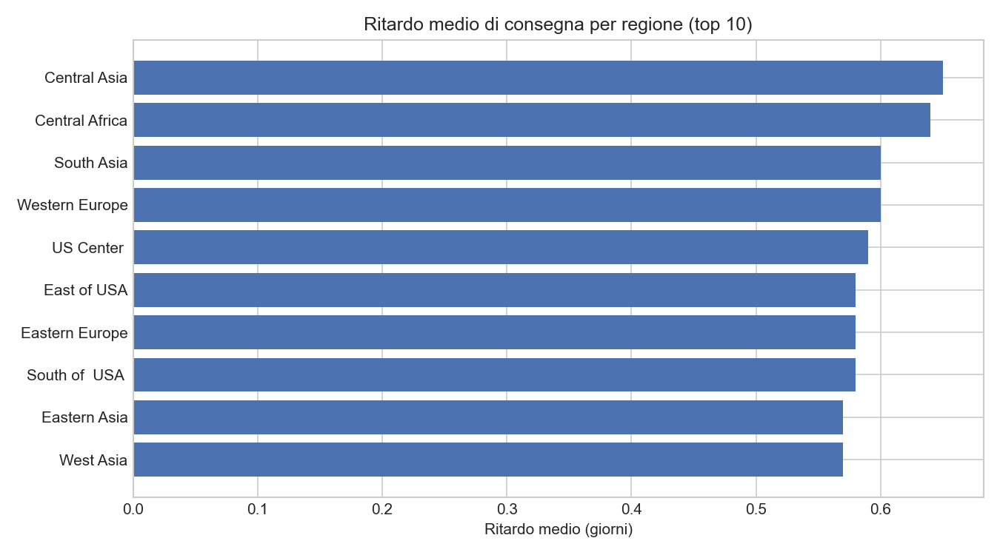
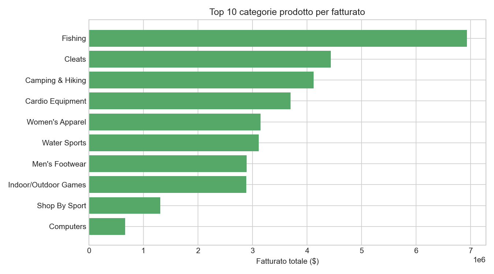
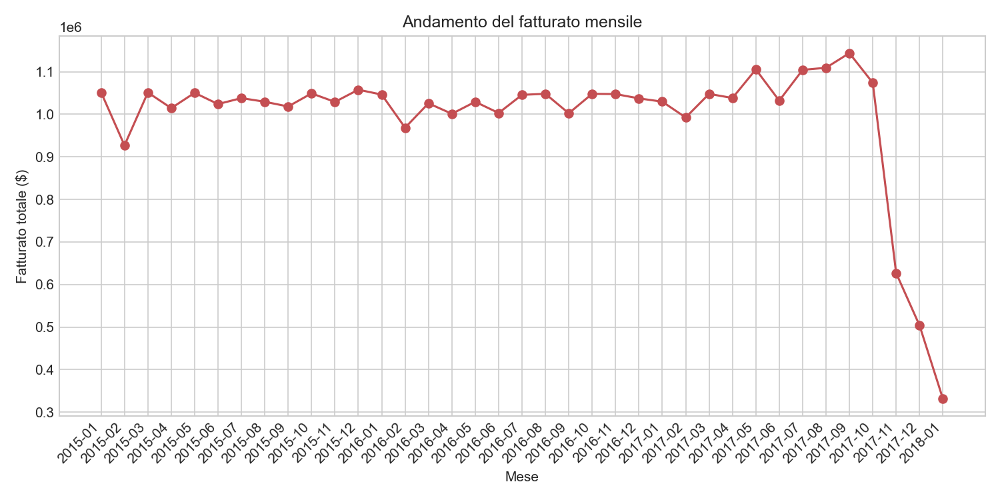
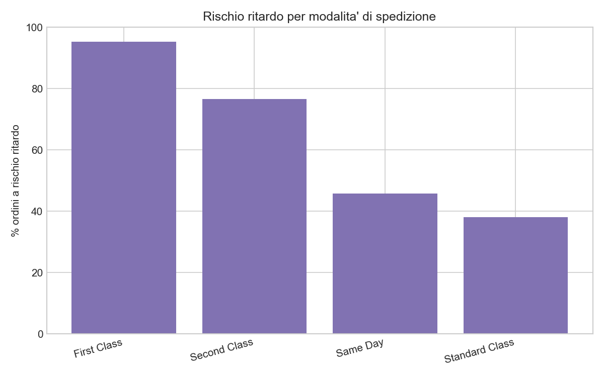

# DataCo supply chain analytics

Analisi SQL su un dataset di supply chain globale (18.000+ ordini, 50+ variabili), con l'obiettivo di individuare pattern su tempi di consegna, ritardi e performance per categoria prodotto e regione.

## Dataset

[DataCo Smart Supply Chain for Big Data Analysis](https://www.kaggle.com/datasets/shashwatwork/dataco-smart-supply-chain-for-big-data-analysis) — dati simulati su ordini, spedizioni, clienti e prodotti di un'azienda di distribuzione globale.

## Obiettivo

Rispondere a domande operative tipiche di una supply chain / ops:
- Quali regioni hanno i ritardi di consegna maggiori?
- Quali modalita' di spedizione sono piu' affidabili?
- Quali categorie prodotto generano piu' fatturato?
- Come varia il fatturato nel tempo?

## Struttura

- `dataco_starter.py` — carica il CSV in MySQL ed esegue query KPI di esempio
- `queries/kpi_queries.sql` — tutte le query SQL scritte per l'analisi

## Risultati principali

- La regione con il ritardo medio di consegna piu' alto è Central Asia con 0.65 giorni di ritardo medio
- La modalita' di spedizione piu' affidabile è Standard Class, con solo il 39% di ordini a rischio ritardo
- - La categoria Fishing genera da sola circa 7 milioni di $ di fatturato, quasi il doppio della seconda categoria (Cleats)

## Visualizzazioni

## Autore

Riccardo Rossi — [LinkedIn](https://linkedin.com/in/riccardorossi-471597250)
